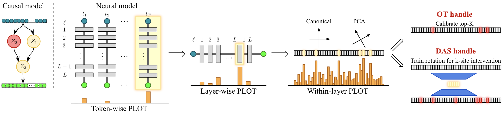

# PLOT: Progressive Localization via Optimal Transport

This repository contains the experiment code for the PLOT paper. The publication-facing experiment code is organized under `experiments/` by benchmark.

The local `paper/` folder is gitignored. It can contain manuscript sources, generated figures, and other paper-build artifacts on a developer machine, but it is not part of the tracked repository.

<p align="center">
  
</p>

*Figure: PLOT as a progressive localization engine. The diagram follows one high-level variable, $Z_2$ in red, though OT localization is performed jointly over all high-level variables and candidate neural sites. PLOT first localizes coarse sites such as tokens/layers, then refines within them to coordinates or PCA spans. The resulting signal can be calibrated into a direct handle or used to guide DAS.*

Run commands from the repository root.

## Main Paper Experiments

The following folders correspond to the experiments reported in the main paper.

### Hierarchical Equality

Location: `experiments/heq/`

Task: hierarchical equality over inputs `W, X, Y, Z`, with abstract variables `WX = [W == X]` and `YZ = [Y == Z]`.

Methods:

- `PLOT`: OT/UOT transport handles over individual hidden-neuron sites.
- `DAS`: rotated subspace intervention search on the same factual backbone.

Entry points:

```bash
python experiments/heq/equality_run.py
python experiments/heq/equality_calibration_strategy_sweep.py
python experiments/heq/equality_clean_epsilon_sweep.py
python experiments/heq/equality_paper_figures.py
```

`equality_paper_figures.py` regenerates the HEQ plots under the local ignored `paper/plots/` folder from saved result JSON files.

### 4-Bit Binary Addition

Location: `experiments/binary_addition/`

Task: 4-bit ripple-carry addition with a GRUCell backbone. The abstract variables are the internal carries `C1`, `C2`, and `C3`; the output is `(C4, S3, S2, S1, S0)`.

Methods:

- `PLOT`: Stage A timestep localization.
- `PLOT-native`: Stage A plus native-coordinate Stage B handles.
- `PLOT-PCA`: Stage A plus PCA-basis Stage B handles.
- `PLOT-DAS`: DAS restricted to the Stage A timestep.
- `Full DAS`: DAS over all recurrent timesteps and subspace sizes.

Entry points:

```bash
python experiments/binary_addition/run_train_backbone.py --help
python experiments/binary_addition/run_progressive_plot.py --help
python experiments/binary_addition/run_progressive_plot_stage_b_resolution_sweep.py --help
python experiments/binary_addition/plot_progressive_heatmaps.py --help
```

### MCQA

Location: `experiments/mcqa/`

Task: Gemma-2-2B multiple-choice question answering on the CopyColors-style MCQA benchmark. The abstract variables are `answer_pointer` and `answer_token`.

Methods:

- `PLOT`: Stage A UOT layer localization.
- `PLOT-native`: Stage A plus native-coordinate Stage B handles.
- `PLOT-PCA`: Stage A plus PCA-basis Stage B handles.
- `PLOT-DAS`: DAS restricted to the Stage A layer.
- `PLOT-native-DAS`: DAS guided by the native Stage B support.
- `PLOT-PCA-DAS`: DAS guided by the PCA Stage B support.
- `Full DAS`: DAS over all layers and the full subspace grid.

Main local/serial entry points:

```bash
python experiments/mcqa/mcqa_delta_hierarchical_sweep.py --help
python experiments/mcqa/mcqa_run_cloud.py --help
python experiments/mcqa/mcqa_paper_runtime.py --help
```

Cluster launchers are in `experiments/mcqa/slurm/`. For the staged Delta workflow:

```bash
bash experiments/mcqa/slurm/submit_delta_mcqa_hierarchical_parallel_all.sh <timestamp>
```

MCQA requires access to the model and dataset. Set `HF_TOKEN` or `HUGGING_FACE_HUB_TOKEN` before launching non-interactive runs.

## Additional Experiment Folders

These folders are included under `experiments/` for completeness. They are not the main-paper experiment folders listed above.

- `experiments/binary_addition_c1/`: fixed-`C1` MLP binary-addition benchmark.
- `experiments/two_digit_addition/`: two-digit decimal addition experiments and helpers.
- `experiments/heq_intervention_heatmaps/`: HEQ intervention-heatmap plotting utility.
- `experiments/mcqa_broad_sweep/`: broad MCQA Delta sweep and launcher.
- `experiments/mcqa_layerwise/`: MCQA layerwise OT analysis.
- `experiments/mcqa_block_focus/`: MCQA OT/DAS block-focus run.
- `experiments/mcqa_diagnostics/`: MCQA filter diagnostic notebook.
- `experiments/notebook_demos/`: notebook demos for basic interventions, DAS, and addition variants.

## Repository Layout

- `experiments/common/`: shared runtime helpers, pyvene helpers, and variable-width MLP utilities.
- `experiments/heq/`: main-paper HEQ scripts and implementation package.
- `experiments/binary_addition/`: main-paper 4-bit binary-addition scripts and implementation package.
- `experiments/mcqa/`: main-paper MCQA scripts, implementation package, and Slurm launchers.
- `paper/`: local ignored manuscript sources, generated figures, and paper-build artifacts.
- `models/`: local checkpoints.
- `results/`: timestamped experiment outputs.

## Setup

Install the Python dependencies:

```bash
pip install -r requirements.txt
```

Some experiments require additional heavy dependencies already implied by the scripts, including PyTorch, pyvene, transformers, datasets, and POT. MCQA runs are intended for GPU execution; HEQ and binary-addition smoke runs can run on CPU.

## Outputs

Experiment runs write JSON payloads, text summaries, and plot artifacts under `results/` or the output directory passed on the command line. Paper figure scripts write into the local ignored `paper/plots/` folder.

## Quick Checks

After editing code, a lightweight import and syntax check is:

```bash
PYTHONPATH=. python -m compileall -q experiments
```
