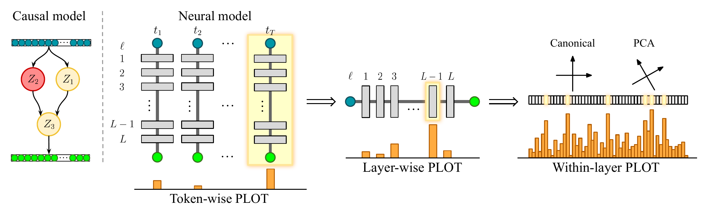

# PLOT: Progressive Localization via Optimal Transport

Code for [PLOT](https://arxiv.org/abs/2605.06979). The current paper experiments
are recorded as **version v4**. Earlier experiments are preserved separately as
versions v1–v3; their configurations and scoring protocols may differ.



PLOT matches causal and neural intervention effects, then refines the candidate
sites from tokens or layers to native coordinates or PCA spans. Selected handles
can be used directly or to guide DAS. The figure is the current manuscript
pipeline; its vector source and provenance are in [figs/](figs/README.md).

## Start here

- **Run baseline MCQA DAS:** [baseline guide](experiments/mcqa/BASELINE_DAS.md).
  Covers preprocessing, calibration, parameter configuration and IIA scoring.
- **Find current paper experiments:** [experiment catalog](experiments/README.md)
  and [paper provenance](docs/experiment_history.md).
- **Find a saved run:** [results index](RESULTS_INDEX.md). The versioned
  run inventory is [experiment_inventory.json](docs/experiment_inventory.json).

## Current paper sources

The latest paper combines several completed runs rather than one newest folder.
The evidence below identifies the artifacts used by its tables. Detailed paths,
protocols and replay caveats are in the catalog.

| Benchmark | Current paper evidence | Current local source |
|---|---|---|
| Hierarchical equality | stable six-epsilon PLOT rerun plus saved DAS, seeds 1-10 | `experiments/heq/heq_rerun/`; shared primitives in `experiments/heq/equality_experiment/` |
| 4-bit binary addition | unrestricted serial OT staging; DAS reused; width 16, seeds 0-4 | `experiments/binary_addition/run_staging_comparison.py`, `run_staging_suite.py`, `run_progressive_plot.py` |
| MCQA | full-beta UOT replay and corrected DAS; DBM, five seeds | `experiments/mcqa/`, paper execution/collection scripts in `experiments/mcqa_staging_budget/` |
| MCQA ablations | signature, matching, KL-guided DAS and balanced-OT Stage A follow-ups | MCQA task packages and paper execution scripts; see results index |

IOI, decimal addition, fixed-carry MLP tasks, 8-bit/variable-length pilots and
older MCQA sweeps are preserved as historical or supporting studies. They are
not the latest manuscript's three main benchmarks.

**Saved results and current code differ.** The saved MCQA DAS results
used corrected full-vocabulary cross-entropy and the MIB substring scorer.
The current DAS code uses strict normalized full-vocabulary top-1 IIA. Later
optimization defaults also differ from some saved HEQ/binary-addition runs.
Use the saved run configuration and code snapshot for an exact historical
comparison; changing the checker or optimizer requires a new run. The provenance
guide distinguishes original reporting, replayed timings and later code changes.

## Repository layout

```text
experiments/
  common/                     shared runtime/model helpers
  heq/                        HEQ implementation and local paper rerun
  binary_addition/            recurrent addition and controlled staging
  mcqa/                       MCQA implementation and standalone DAS
  mcqa_staging_budget/        local paper GPU launch/collection workflows
  ioi/                        preserved earlier IOI benchmark
  archive/
    v1/early_tasks/              decimal addition and fixed-carry MLP
    v2/mcqa_exploration/          superseded broad/layer/block studies
    v1/demos/                    historical notebooks
    v3/figure_utilities/         earlier standalone plotting utility
results/                      local, Git-ignored artifacts
  versions/v1/                initial experiments
  versions/v2/                intermediate follow-ups
  versions/v3/                expanded baselines and pilots
  versions/v4/                paper, supporting and development runs
figs/                         current README image plus archived old image
docs/                         experiment provenance and relocation map
```

Old experiment import paths remain relative compatibility symlinks. Result
references use the versioned canonical paths. New outputs should use the
appropriate version, category and benchmark. Shared active code stays in its
established location. Local results, model checkpoints and some newer paper-run
source packages are not uploaded with this documentation cleanup; availability
is recorded in the experiment catalog.

Manuscripts, figure exports and handoff archives are stored separately in the
linked `Codex Projects/PLOT` workspace (`paper/`, `arxiv_v2/`, `exports/`).
Checkpoints remain under local `models/` and `eval/shared_checkpoints/`.

## Setup and checks

Use Python 3.10 or newer:

```bash
pip install -r requirements.txt
bash experiments/mcqa/run_baseline_das.sh
```

MCQA needs a CUDA GPU and access to Gemma-2-2B. Set `HF_TOKEN` or
`HUGGING_FACE_HUB_TOKEN` before a noninteractive run. Weights and datasets are
loaded separately. Historical notebooks and archival launchers may require their
original environment and protocols; they are not current reproduction commands.

For the tracked baseline, CPU regression tests need no model download:

```bash
PYTHONPATH=.:experiments/mcqa python -m pytest -q \
  experiments/mcqa/test_unified_iia.py \
  experiments/mcqa/test_data_partition.py \
  experiments/mcqa/test_baseline_das_protocol.py
```

Set `PLOT_PAPER_DIR` when generating manuscript figures into a different workspace.
